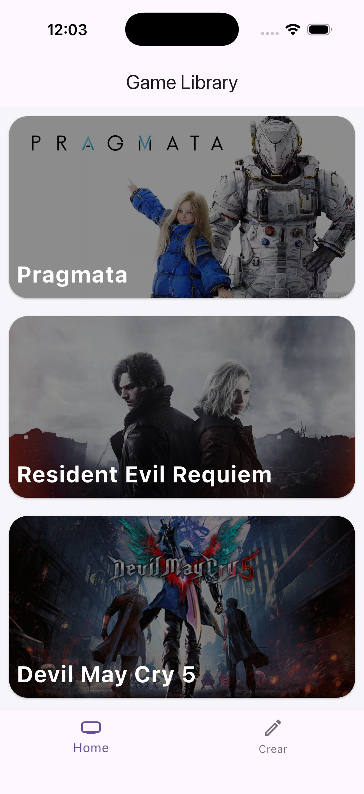
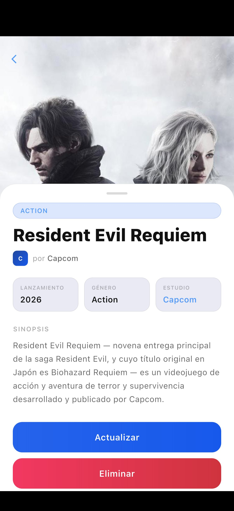
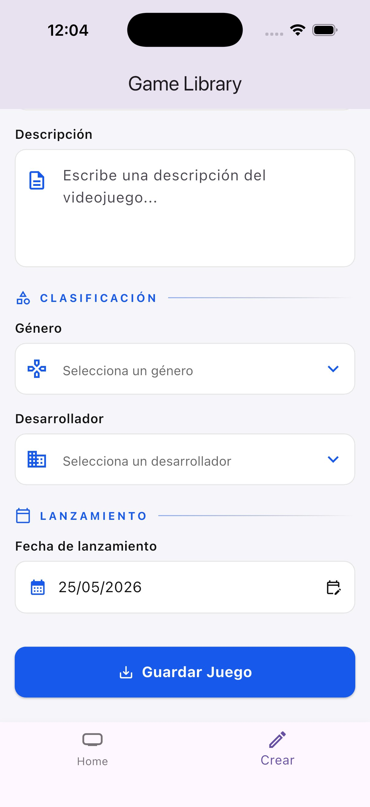

# 🎮 GameLibrary Flutter App

Mobile application for managing a personal video game library, built with **Flutter and Dart**. Connects to a custom REST API ([GameLibrary-API](https://github.com/Adrianalpuche/GameLibrary-API)) built with ASP.NET Core and MySQL.

---

## 📱 Screenshots

| Home | Game Detail | Create / Edit |
|------|-------------|---------------|
|  |  |  |

---

## 🛠️ Tech Stack

| Layer | Technology |
|---|---|
| Framework | Flutter (Dart SDK ^3.11.5) |
| HTTP Client | Dio ^5.9.2 |
| State Management | Provider ^6.1.5 |
| Theme | Material 3 — Light / Dark (system-aware) |
| Backend | [GameLibrary-API](https://github.com/Adrianalpuche/GameLibrary-API) |

---

## 📁 Project Structure

```
lib/
├── config/
│   └── Theme/
│       └── Colors.dart          # Light & dark theme definitions
├── features/
│   └── data/
│       └── api/
│           └── api.dart         # Dio HTTP client — all API calls
├── models/
│   └── games.dart               # Game, Genre, Developer models with fromJson/toJson
├── provider/
│   └── games_provider.dart      # ChangeNotifier — CRUD state management
└── presentation/
    ├── screens/
    │   ├── home/
    │   │   └── home_screen.dart         # Game list with visual cards
    │   ├── gameDetails/
    │   │   └── gameDetails_screen.dart  # Full game detail view
    │   └── form/
    │       ├── create_screen.dart       # New game form
    │       └── update_screen.dart       # Edit game form
    └── widgets/
        └── botom_navigation.dart        # Bottom navigation bar
```

---

## ✨ Features

- 📋 **Game list** — visual cards showing title, image, genre, and developer
- 🔍 **Game detail** — full view with description and release date
- ➕ **Create game** — form with title, image URL, description, genre, developer, and release date
- ✏️ **Edit game** — pre-filled form for updating existing entries
- 🗑️ **Delete game** — removes entry and refreshes list automatically
- 🌗 **Adaptive theme** — UI switches between light and dark mode based on system settings

---

## 🏗️ Architecture

### API Layer (`api.dart`)
Dedicated class using **Dio** as the HTTP client. Each method maps directly to a REST endpoint:

| Method | Endpoint | Description |
|--------|----------|-------------|
| `getGames()` | `GET /api/games` | Fetch all games |
| `getGameDetails(id)` | `GET /api/games/{id}` | Fetch single game |
| `postGame(...)` | `POST /api/games` | Create a game |
| `updateGame(...)` | `PUT /api/games/{id}` | Update a game |
| `deleteGame(id)` | `DELETE /api/games/{id}` | Delete a game |

### State Management (`games_provider.dart`)
`GamesProvider` extends `ChangeNotifier` and centralizes all state:

- `_games` — private list exposed via getter, preventing external mutation
- `gameDetails` — `Map<int, Games>` cache to avoid redundant API calls for already-visited games
- All mutating operations call `notifyListeners()` to reactively update the UI
- `putGame()` re-fetches both the list and the cached detail after a successful update

### Model Layer (`games.dart`)
`Games`, `Genre`, and `Developer` models with:
- Defensive `fromJson` — handles cases where nested objects arrive as either `Map` or JSON `String`
- `==` and `hashCode` overrides on `Genre` and `Developer` for reliable equality checks in form dropdowns

---

## 🚀 Getting Started

### Prerequisites

- [Flutter SDK](https://docs.flutter.dev/get-started/install) ^3.11.5
- The [GameLibrary-API](https://github.com/Adrianalpuche/GameLibrary-API) running locally

### 1. Clone and install dependencies

```bash
git clone https://github.com/Adrianalpuche/GameLibrary-Flutter.git
cd GameLibrary-Flutter
flutter pub get
```

### 2. Start the backend

Follow the setup instructions in [GameLibrary-API](https://github.com/Adrianalpuche/GameLibrary-API) to run the API and database with Docker.

The API should be available at `http://localhost:5207`.

### 3. Run the app

```bash
flutter run
```

---

## 📦 Dependencies

```yaml
dependencies:
  dio: ^5.9.2        # HTTP client with interceptors and error handling
  provider: ^6.1.5   # Reactive state management
  cupertino_icons: ^1.0.8
```

---

## 🔗 Related Project

This app consumes the REST API built in a companion project:

**[GameLibrary-API](https://github.com/Adrianalpuche/GameLibrary-API)** — ASP.NET Core 10 · Entity Framework Core · MySQL · Docker

---

## 👤 Author

**Adrian Alpuche**  
[GitHub](https://github.com/Adrianalpuche)